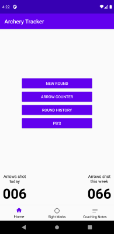
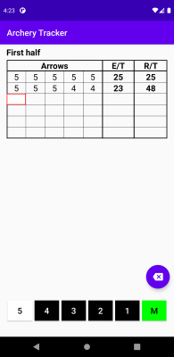
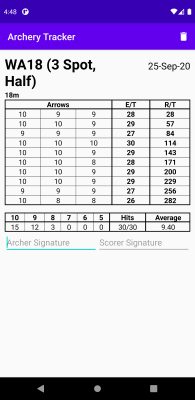

# Archery Tracker
This is my CS50 final project. Below is video demonstrating the main features. More details about the features can be found further down.

## Features
##### Arrow counter
  * A daily arrow counter is shown on the bottom right of the home screen, it includes arrows added via the arrow counter or from arrows shot in scored rounds. This counter resets each day.

  

  * A weekly arrow counter is shown on the bottom left of the home screen, it shows the number of arrows shot from the previous Monday to the current date inclusive.
  * There is an arrow counter which can be used to add and subtract arrows from the daily arrow counter using plus and minus buttons. Accessed by pressing the "Arrow Counter" button on the home screen.

  

#### Shooting a round
  * The app includes a selection of archery rounds. Once you click "New Round" you'll be able to choose from this list, you can also search the list by round name.
  * Once a round is selected it then displays the distances for that round, which you can select to then score arrows for that distance.
  * The scoring screen displays the scorecard for that distance which includes arrow values, end totals and running totals. The current selected box is highlighted in red and this is where input from the buttons will fill. The selected box automatically moves to the next arrow when a value is entered. You can select any arrow value box by clicking on it.
  * There are buttons coloured according to the colours on the target for entering arrow values. The buttons change depending on the scoring type of the round. For indoor rounds there is no "X" as I'm a recurve archer.
  

  * You can exit a round in progress and the "New Round" button on the home screen will change to "Continue Round" and take you back to the screen where you can choose which distance to score arrows for.
  * If you wish to delete a round in progress press the delete button found on the distance selection screen.
  * The distance selection screen also shows your current total score and score for each distance.
  * Once a round is completed a save button appears and you can save your round. Saving the round will take you to the full scorecard which includes a summary of arrows shot at each value on the target, as well as the number of hits and overall average. There is also the option for the archer and scorer to sign the scorecard.

  

#### Round history
  * You can view your past rounds by selecting "Round History", this will display the most recently recorded rounds first. You can also filter the history by the name of the round.

  
  * You can select a round in the round history to see the completed scorecard for that round.

#### PB's
  * You can view your personal best score for all rounds recorded in the app by selecting the "PB's" button.
  
  

#### Sight marks
  * If you select the sight marks button in the bottom navigation bar you can view your sight marks. These are sorted into metric sight marks first in ascending order and then imperial sight marks also in ascending order.
  
    
  * You can add a new sight mark by selecting the add button, which will then bring up a screen for you to fill in the distance, use a drop down to select the units (m or yd) and type in your sight mark.
  
  
  
  * If you exit an incomplete sight mark the app will automatically delete the sight mark and let you know.
  * You can save a completed sight mark by pressing the save button or simply by pressing back.
  * If you click on a sight mark there is also a delete button.

#### Coaching notes
  * If you select the coaching notes button in the bottom navigation bar you can view a list of notes. These are sorted by most recent first.

  
  * On this screen you can see the date the note was created and the title of the note.
  * By clicking on a note you can see its date of creation, title and contents, the title and contents are editable. The changes to these fields can be saved by pressing the save button or by pressing the back button.
  
    
  
  * You can add a new note by clicking the add button, which will create a note with today's date associated with it.
  * You can save a note without content but it must have a title. If you attempt to save or exit a note with no title it will not be saved and the app will inform you of this.
  * There is also a delete button in each note. 
